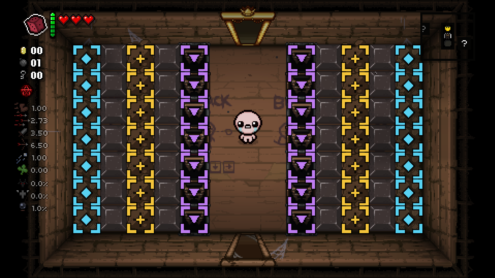

# Secrets Reveal

A Binding of Isaac: Repentance mod that reveals what the floor is hiding.

**[Subscribe on the Steam Workshop](https://steamcommunity.com/sharedfiles/filedetails/?id=3780562693)**
— or install manually, see below.



*Same room [without the mod](workshop/screenshot-1-off.png). Note the `?` icons
that appear on the minimap: those are the secret rooms being revealed.*

## What it does

**On the map**

| Thing | Behaviour |
| --- | --- |
| Secret Room | Revealed with its icon as soon as you arrive on the floor |
| Super Secret Room | Same |
| Ultra Secret Room | Same |
| Crawlspace rooms | Rooms whose layout contains a crawlspace are revealed too |

**Inside the room** — a pulsing reticle is drawn over:

| Marker | Meaning |
| --- | --- |
| Cyan diamond | Tinted Rock |
| Gold star | Super Tinted Rock |
| Violet arrow (solid) | Crawlspace |
| Green arrow (hollow, faint) | Downpour/Dross rubble rock that *may* hide a crawlspace |

The green marker is a **candidate, not a promise**. The game rolls for a
crawlspace when the rock is destroyed, not when the floor is generated, so
there is nothing to read in advance — it only tells you which rocks are worth
breaking. It's drawn at 55% alpha because those rocks are common, and left out
of the room notices for the same reason.

Rock markers disappear the moment the rock is broken. Crawlspaces that get
uncovered mid-fight (Downpour rubble rocks, bombed floors) are picked up
automatically — the room is re-scanned a few times a second.

A short line of small text in the **bottom-left corner** summarises each new
floor and each room you walk into, newest line at the bottom. That can be
resized or turned off.

If it ever collides with the pocket item / card slot, raise
`NOTICE_BOTTOM_MARGIN` near the top of the Notifications section in
`main.lua` — `NOTICE_X` moves it horizontally.

## Install

Copy this folder into the game's `mods` directory — note that this lives in the
**game install**, not in `Documents\My Games\...` (that one only holds saves and
`options.ini`).

| OS | Path |
| --- | --- |
| Windows | `…\Steam\steamapps\common\The Binding of Isaac Rebirth\mods\` |
| macOS | `~/Library/Application Support/Steam/steamapps/common/The Binding of Isaac Rebirth/mods/` |
| Linux | `~/.steam/steam/steamapps/common/The Binding of Isaac Rebirth/mods/` |

Or clone straight into it:

```
git clone https://github.com/ghoulfik/tboi-secrets-reveal.git secrets-reveal
```

Then launch the game, open **Mods** from the title screen, and make sure
**Secrets Reveal** is enabled. Restart the game after enabling it.

Enable the debug console (`--luadebug` in the Steam launch options) if you want
the `secrets` command.

The mod is Lua-only plus one sprite — no `content/` overrides — so it does not
conflict with anything else and does **not** disable achievements.

## Controls

* **F5** — toggle the whole mod on/off in game.
* **F6** — show/hide the bottom-left notices. On by default.
* Debug console: `secrets`, `secrets on`, `secrets off`,
  `secrets logs`, `secrets logs on`, `secrets logs off`.

Both keys save immediately, so the state carries across runs and restarts.
Hiding the notices does not affect the map reveal or the in-room markers.

## Configuration

Install [Mod Config Menu](https://steamcommunity.com/sharedfiles/filedetails/?id=2681875787)
to get a **Secrets Reveal** category with:

* *Map* — per-room-type reveal toggles, crawlspace room reveal
* *Markers* — per-marker toggles, pulsing on/off, marker size (50–200%),
  notices on/off, notice text size (50–200%), both rebindable keys

Without Mod Config Menu the defaults apply (everything on). Settings are saved
per-mod, so they survive restarts either way.

## Notes and limits

* Revealing a room on the map is exactly what Blue Map does — it shows you
  *which wall* to bomb, not the door itself.
* Turning the mod off does not un-reveal rooms already drawn on the map; the
  game has no API for hiding a room again. It stops revealing new ones.
* Crawlspace room detection reads the room's layout data. A handful of layouts
  place a crawlspace in a weighted slot shared with other objects, so a very
  small number of flagged rooms may turn out not to have one.
* Crawlspaces created at random from Downpour/Dross rubble rocks cannot be
  known ahead of time — those are only marked once they actually appear, via
  the in-room marker.

## Layout

```
Secrets_reveal/
├── main.lua                              all mod logic
├── metadata.xml                          mod manifest
├── resources/gfx/
│   ├── secretsreveal_markers.anm2        3-frame marker animation
│   └── secretsreveal_markers.png         96x32 sheet (3 x 32x32 markers)
└── tools/make_markers.ps1                regenerates the PNG
```

To change the marker art, edit `tools/make_markers.ps1` and run:

```
powershell -ExecutionPolicy Bypass -File tools\make_markers.ps1
```
